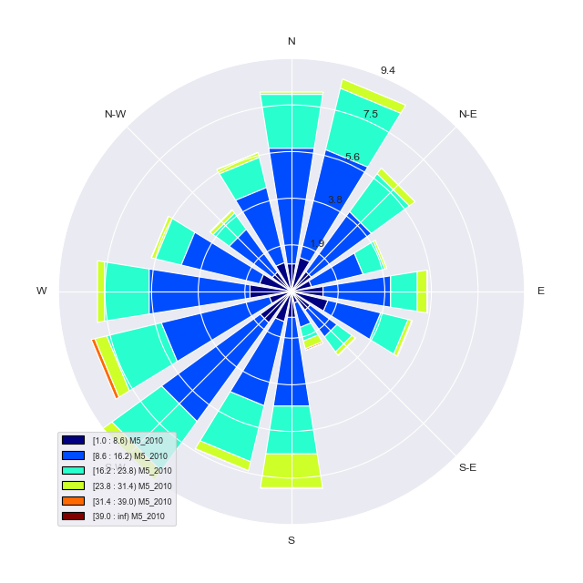
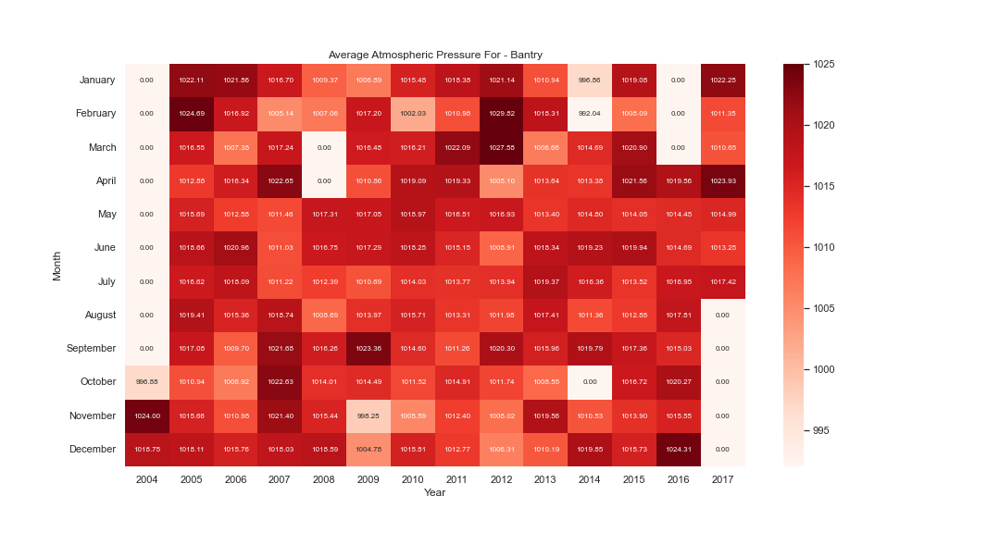
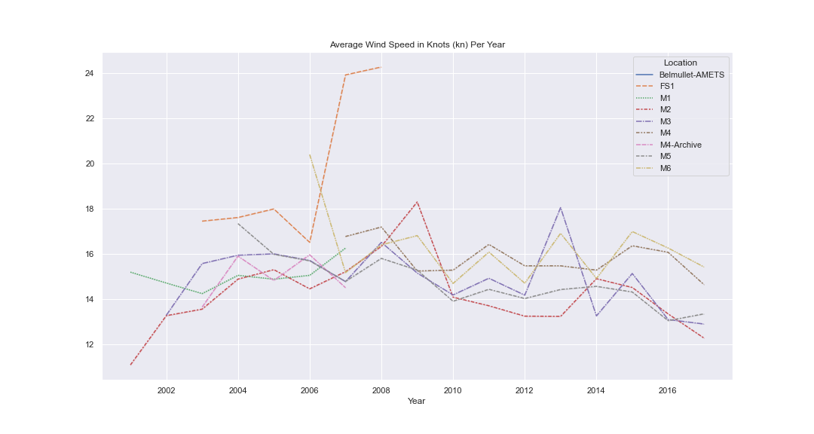

# Apple_Interview
Using the technology of your choice: - Save the provided data-set into a database - Show / visualise the data 

For this project I decided to use the Python programming language as I felt this was the best choice because of the capabilities of python in data presentation. Python is widely used in artificial intelligence with multiple libraries that could help with the data provided. One such library that I was keen to use was Pandas which allows users to create dataframes from sources such as the csv files provided. Another such library that would be very useful for this project is Seaborn which is a data visualisation tool that uses matplotlib, another useful library. The next decision that had to be made was the database that would be used. For this I decided on using MySQL as I had previous expierence using this application. As the data provided relates to wind and atmospheric pressure data, I researched how best to display the information. I discovered that the information provided could be used to create a wind rose, which also had a python library, this was called WindRoseAxes.

Imports required
```python
import pandas as pd
import matplotlib.pyplot as plt
import seaborn as sns
import mysql.connector as db  
from windrose import WindroseAxes
from pandas.api.types import CategoricalDtype
import numpy as np

```

Firstly I established connection to the database

```python
    connection_to_db = db.connect(user='apple_interview', password='luna123',
                                  host='localhost',
                                  database='apple_interview')

    cursor = connection_to_db.cursor()
```
Next, I updated the data as it contained some invalid data such as NaN values.

```python
    data_df.fillna(method='bfill', inplace=True)
    data_df['time'] = pd.to_datetime(data_df["time"], format="%Y-%m-%dT%H:%M:%SZ")
```

Before finally adding the data-set to the database
```python
    cursor.execute('''
                        CREATE TABLE IF NOT EXISTS location_merged (
                            locationID nvarchar(50), 
                            locationName nvarchar(50),
                            time nvarchar(50),
                            atmospheric_pressure int,
                            wind_direction int,
                            wind_speed decimal(8,4),
                            gust decimal(8,4),
                            primary key (locationID, time)                          
                            )
                        ''')   
   
    #Create query variable 
    sql_query = ' REPLACE INTO location_merged (locationID, locationName, time, atmospheric_pressure, wind_direction, wind_speed, gust) VALUES (%s,%s,%s,%s,%s,%s,%s)'
    
    #Loop through DataFrame while executing query with DataFrame values    
    for row in mergedLocation_Data.itertuples():
          cursor.execute(sql_query,(row.locationID,row.locationName,row.time,row.AtmosphericPressure,row.WindDirection,row.WindSpeed,row.Gust,))     
          
    #Commit changes made       
    connection_to_db.commit()
    
```
This function acts as the initial function for the data, here columns are added for month and year that will make later operations easier. A for loop is used here to cycle through each location. Checks are also made to ensure some data exists for the station in order to avoid unnecessary operations. Calls to other functions are made to get data for other functions and graphs. 
```python
 def data_function(df,map_df): 
    
    #Adding columns for year and month to the DataFrame
    df['Year'] = pd.DatetimeIndex(df['time']).year
    df['Month'] = df['time'].dt.month_name()

    average_speed_data = []
    #First loop cycles through each location ID
    for l_id in unique_locations:
        #Check to make sure data exists for current location ID
        if (df['locationID'] == l_id) .any():
            #Create DataFrame for current location
            location_df = df.loc[(df['locationID'] == l_id)]
            average_ap_data = get_yearly_data(location_df, l_id, average_speed_data)
            
            #Create location name variable for graph title
            location_name = map_df.loc[map_df['locationID'] == l_id]['locationName'].astype("string").item()
            pivot_df= atmospheric_pressure_data(l_id, average_ap_data,df)
            
            if print_graphs:
                heat_map(location_name,pivot_df)
    
    #Create DataFrame with average speed data
    average_speed_df = pd.DataFrame(average_speed_data,columns=('Year','Location','AverageWindSpeed','AverageGustSpeed'))    
    wind_speed_df_wide, wind_gust_df_wide = pivot_tables(average_speed_df)
    dataframes = [wind_speed_df_wide, wind_gust_df_wide]
    
    if print_graphs:
        line_plot(dataframes)
    
```
This function cycles through each year the location is in use, while also checking to make sure data exists. From here the wind speed and wind direction values are calculated by calling the wind data function before being passed to the wind rose function to be displayed. The average atmospheric pressure per month is also calculated before being retured here, this is used in another function where another graph is produced.
```python
def get_yearly_data(location_df, l_id, average_speed_data):
    
    #Initialising average atmospheric pressure array
    average_ap_data = []
    for year in unique_years:
        #Check to make sure data exists for current location ID during current year
        if ((location_df['locationID'] == l_id) & (location_df['Year'] == year)).any():
            #Create DataFrame for current year
            yearly_df = location_df.loc[location_df['Year'] == year]
            
            ws, wd, wg, average_speed_data = get_wind_data(yearly_df, year, average_speed_data, l_id)
            
            if print_windrose:
                wind_rose(wd, ws, l_id, year)
                
            average_ap_data = get_monthly_data(yearly_df, year, average_ap_data)
            
    return average_ap_data
    
```
This function extracts the wind speed, wind direction and wind gust values that will be used in calculations such as the wind rose. Average speeds are also calculated that will be used to compare yearly average wind speeds between locations. The calculated values are returned
```python
def get_wind_data(yearly_df, year, average_speed_data, l_id):
    
    #Extract all values for wind speed, wind direction and gust for current location id and year.
    ws = yearly_df['WindSpeed'].values       
    wd = yearly_df['WindDirection'].values         
    wg = yearly_df['Gust'].values
    
    #Calculate average speeds rounded to 2 decimal places
    average_wind_speed = np.around(np.average(ws),decimals = 2)
    average_gust_speed = np.around(np.average(wg),decimals = 2)
    
    #Append data to average speed data list
    average_speed_data.append([year,l_id,average_wind_speed,average_gust_speed])
     
    #Return wind related values
    return ws, wd, wg, average_speed_data
    
```
This function creates the wind rose using ws and wd which were returned in the previous function. The resulting graph is labeled and saved to the images folder
```python
def wind_rose(wd, ws, l_id, year):
    
    #Create and show Wind Rose Graph
    ax = WindroseAxes.from_ax()
    ax.bar(wd, ws, normed=True, opening=0.8, edgecolor='white')
    unit = str(l_id) + '_' + str(year)
    filename = 'images\WindRose_' + unit + '.PNG'
    ax.set_legend(units = unit)
    plt.savefig(filename)
    plt.show()   
    
```
A sample wind rose can be seen below.



This function is used to get monthly data for each location per year. The resulting values are stored a list which will later be used in a dataframe, this list is returned. The use of the data here is for creating a graph illustrating the average monthly atmospheric pressure for each location. The graph is displayed in another function
```python
def get_monthly_data(yearly_df, year, averge_ap_data):
    
    for month in unique_months:
        #Check to make sure data exists for current location ID during current year and current month
        if ((yearly_df['Year'] == year) & (yearly_df['Month'] == month)).any():
            #Create DataFrame for current year
            monthly_df = yearly_df.loc[yearly_df['Month'] == month]
            #Calculate average atmospheric pressure rounded to 2 decimal places
            average_ap = np.around(np.average(monthly_df['AtmosphericPressure'].values),2)
            #Append data to average atmospheric pressure data list
            averge_ap_data.append([year,month,average_ap])
            
    return averge_ap_data 
    
```
This function takes the list returned in the previous function, creates a dataframe before pivoting the table so that the data can be used in the desired plot. After pivoting any NaN values are replaced with 0s. the resulting dataframe is returned
```python
def atmospheric_pressure_data(l_id,average_ap_data,df):
 
    #Create DataFrame for atmospheric pressure
    atmospheric_pressure_df = pd.DataFrame(average_ap_data,columns=('Year','Month','Avg_Atmospheric_Pressure'))   
    #Replace blank and NaN entries with 0s  
    #Update category of Month column
    atmospheric_pressure_df['Month'] = atmospheric_pressure_df['Month'].astype(cat_type) 
    pivot_df = atmospheric_pressure_df.pivot('Month','Year','Avg_Atmospheric_Pressure')  
    #Replace blank and NaN entries with 0s 
    pivot_df.fillna(0, inplace=True)   

    return pivot_df 
    
```
This function takes the previous dataframe and passes it to seaborn to create a heatmap. The minimum value is set by taking the lowest value for each individual location. To better display the heatmap the figure size and font sized have been changed.
```python
def heat_map(location_name,pivot_df):    
    #Set Seaborn grid type
    sns.set_style('darkgrid')    
    #Title of graph
    title = 'Average Atmospheric Pressure For - ' + location_name
    filename = 'images\\Graph_' + title + '.PNG'
    plt.title(title)
    #Update the sizing of the Seaborn graph
    sns.set(rc = {'figure.figsize':(15,8)})
    #Set min value to that of the min value of the data
    min_for_location = pivot_df.mask(pivot_df==0).min().min()
    #Plot heatmap with new DataFrame, updated minimum and other settings
    sns.heatmap(pivot_df, vmin= min_for_location,vmax=1025, fmt='.2f',annot=True, cmap='Reds',annot_kws={"fontsize":8})        
    plt.savefig(filename)
    plt.show()   
    
```

A sample heatmap can be seen below.




This function takes the dataframes for average wind speeds and average gust speeds. Note these dataframes have been pivoted for the lineplot graph. A simple for loop is used to avoid repeating code for displaying each graph and corresponding title.

```python
def line_plot(dataframes):

    titles = ['Average Wind Speed in Knots (kn) Per Year','Average Gust in Knots (kn) Per Year']
    #Set Seaborn grid type
    for i in range(0,len(dataframes)):    
        sns.set_style('darkgrid')
        filename = 'images\\' + titles[i] + '.PNG'
        #Create lineplot
        sns.lineplot(data = dataframes[i])
        plt.title(titles[i])                 
        plt.savefig(filename)
        plt.show()     
    
```

A sample lineplot can be seen below. From this lineplot, it can be observed that not every location is active for every year represented in the data-set. 



Here the data-set is initially read from the csv files. The data is updated and a merged dataframe is created.These are sent to the database. Initially the data is imported as unicode but will be changed at a later stage. Some global variables are set that will be used in other functions, these include unique fields and some settings for disabling certain graphs, these settings are largely used for testing. The fields in the merged dataset that should be numeric e.g wind speed are set to be numeric by a pandas function.

```python
if __name__=="__main__":
    
    #Loads csv data into DataFrame
    locationData_csv = pd.read_csv (r'C:\Users\35387\OneDrive\Desktop\Apple Interview\locationData.csv',dtype='unicode')
    locationMap_csv = pd.read_csv (r'C:\Users\35387\OneDrive\Desktop\Apple Interview\locationMap.csv',dtype='unicode')
    
    data_df = pd.DataFrame(locationData_csv)
    data_df = data_df.iloc[1:,:]
    map_df = pd.DataFrame(locationMap_csv)
 
    data_df.fillna(method='bfill', inplace=True)
    data_df['time'] = pd.to_datetime(data_df["time"], format="%Y-%m-%dT%H:%M:%SZ")
    
    mergedLocation_Data = pd.merge(data_df, map_df, on='locationID', how='outer')
    mergedLocation_Data = mergedLocation_Data.iloc[1:,:]
    mergedLocation_Data = mergedLocation_Data[['locationID', 'locationName','time', 'AtmosphericPressure', 'WindDirection', 'WindSpeed', 'Gust']]
    
    database_entry(data_df,map_df,mergedLocation_Data)  

    month_cat = ['January','February','March','April','May','June','July','August','September','October','November','December']
    cat_type = CategoricalDtype(categories=month_cat, ordered=True)
    
    mergedLocation_Data['Year'] = pd.DatetimeIndex(mergedLocation_Data['time']).year
    mergedLocation_Data['Month'] = mergedLocation_Data['time'].dt.month_name()
    
    global unique_locations, unique_years, unique_months,print_windrose, print_graphs, display_to_console
    
    unique_locations = mergedLocation_Data['locationID'].unique()
    unique_years = mergedLocation_Data['Year'].unique()
    unique_months = mergedLocation_Data['Month'].unique()
    
    print_windrose= True
    print_graphs = True

    
    #Initialising average speed list
    average_speed_data = []
    
    mergedLocation_Data[['WindSpeed','Gust', 'AtmosphericPressure','WindDirection']] = mergedLocation_Data[["WindSpeed", "Gust", 'AtmosphericPressure','WindDirection']].apply(pd.to_numeric)
    
    data_function(mergedLocation_Data,map_df)   
    
```
